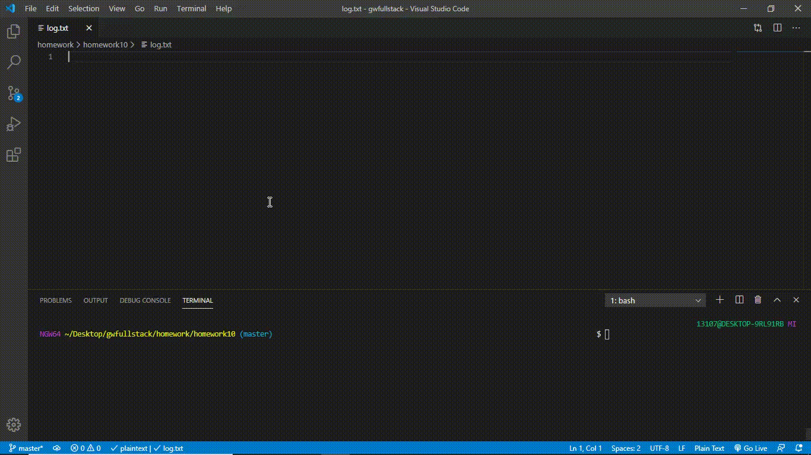

## Table of contents

- [General info](#general-info)
- [Instructions](#instructions)
- [Functionality](#functionality)
- [Technologies](#technologies)
- [Dependencies](#dependencies)

## General Info

This application is a CLI app. This app builds a software engineering squad by taking in user inputs via inquirer prompts and displaying them to the user. The input information gets stored in a txt file that is dynamically appended to. Jest is used as a dev dependency to test the application. All three subclasses are extended off of the main employee class and inherit all of employee's properties.

## Instructions

The user must install inquirer to run this application and jest if they want to test it. The user will be prompted with questions that they should answer. All of their answers then get stored in a txt file, that grows as the software engineering team expands.

## Functionality

## Technologies

Node version 12

## Dependencies

- Inquirer version 7.0.4
- Jest version 25.1.0
